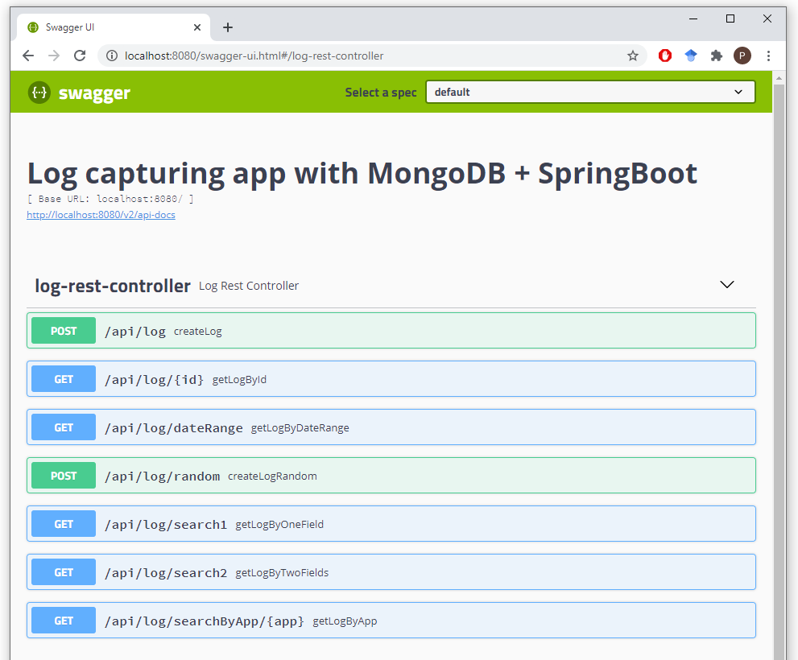

# Log Capturing (with MongoDB + SpringBoot + Swagger UI)

This demo application showcases MongoDB and its capability to store
data of varying schema.

## Prerequisites

* Java and Maven
* A MongoDB server running locally on default port 27017

## The data model

Each log event is represented as a key-value Map.

An example log might look like this:
```json
{
  "logEvent": {
    "_id": "5f5542649469105a541140e1",
    "_appType": "PAYMENT",
    "_createDate": "2020-09-07T10:11:16.435",
    "severity": "ERROR",
    "creditCardProvider": "VISA",
    "message": "Payment failed",
    "paymentAmount": "9.90"
  }
}
```

## REST Endpoints



## Run the App

Go ahead and compile the source code. Then start the SpringBoot app `LogCaptureApp`.
Now you're ready to fire REST requests on http://localhost:8080/swagger-ui.html.

**Store logs**:
* `createLogRandom`: Create a random log entry. You can choose the log source.
* `createLog`: Create a log entry from JSON. You can use any fields you want.

**Display logs**:
* `getLogByApp`: Search all log entries from a specific application of origin.
* `getLogByDateRange`: Search logs by time range.
* ... or use any other REST GET endpoint
